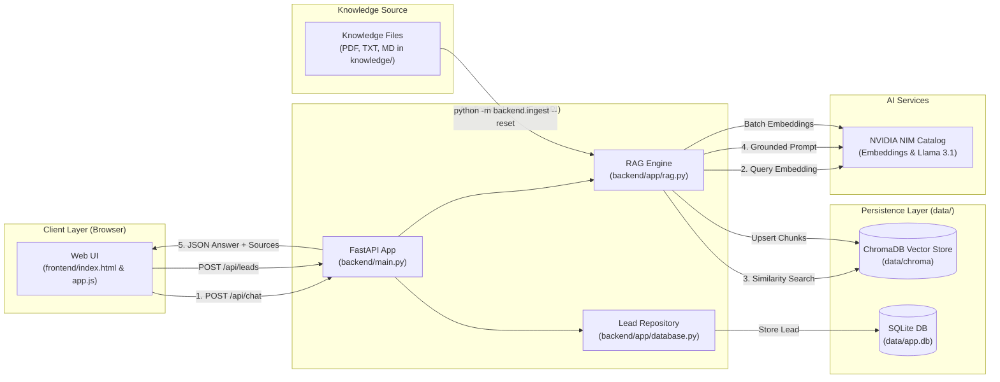

# 🤖 AI FAQ Chatbot & RAG Assistant

[](https://www.python.org/)
[](https://fastapi.tiangolo.com/)
[](https://build.nvidia.com/)
[](https://www.trychroma.com/)
[](https://www.sqlite.org/)
[](https://www.docker.com/)
[](LICENSE)

A high-performance, production-oriented Enterprise FAQ Chatbot and Retrieval-Augmented Generation (RAG) system. Powered by **NVIDIA NIM Microservices**, **ChromaDB**, **FastAPI**, and **SQLite**. 

The assistant provides grounded, halluncination-free responses based exclusively on custom enterprise knowledge documents (`.pdf`, `.txt`, `.md`), features intelligent metadata tagging for interactive portfolio displays, and provides a secure, isolated lead-capture funnel.

---

## 📋 Table of Contents

- [Features](#-features)
- [Architecture Overview](#-architecture-overview)
- [Project Directory Structure](#-project-directory-structure)
- [Prerequisites](#-prerequisites)
- [Quick Start Guide](#-quick-start-guide)
- [Knowledge Base Management](#-knowledge-base-management)
- [Docker Deployment](#-docker-deployment)
- [API Reference](#-api-reference)
- [Testing & Quality Assurance](#-testing--quality-assurance)
- [Production Deployment & Security](#-production-deployment--security)
- [Documentation & Resources](#-documentation--resources)
- [License](#-license)

---

## ✨ Features

- **🎯 Zero-Hallucination RAG Pipeline**: Restricts LLM responses strictly to verified documents stored in the `knowledge/` directory.
- **⚡ High-Efficiency NVIDIA NIM Integration**: Leverages `nvidia/nv-embedqa-e5-v5` for query/passage embeddings and `meta/llama-3.1-8b-instruct` for fast, accurate generation.
- **🔍 Local Vector Storage**: Embedded **ChromaDB** database for fast approximate nearest-neighbor vector search without external managed DB overhead.
- **📊 Smart Portfolio Rendering**: Detects portfolio queries via custom chunk metadata (`is_portfolio=true`) and automatically formats project portfolios into clean, responsive Markdown/HTML tables.
- **📬 Secure Lead Capture Funnel**: Dedicated `/api/leads` endpoint using SQLite (`data/app.db`) with parameterized queries, keeping visitor contact details completely isolated from LLM prompts and vector stores.
- **🛡️ Enterprise Security**: Integrated CORS protection, host validation, input sanitization, Pydantic data validation, and safe front-end DOM rendering (`textContent`).
- **🐳 Docker & Container Support**: Out-of-the-box `Dockerfile` and `docker-compose.yml` for isolated container deployment with persistent data mounting.

---

## 🏗️ Architecture Overview

The application follows a clean modular architecture separating RAG processing, vector storage, API services, and lead persistence.



For comprehensive data-flow diagrams and component breakdowns, refer to [architecture.md](architecture.md).

---

## 📁 Project Directory Structure

```text
AI-FAQ-Chatbot/
├── backend/                  # FastAPI backend application
│   ├── app/
│   │   ├── config.py         # Centralized environment & settings reader
│   │   ├── database.py       # SQLite database initialization & lead queries
│   │   ├── models.py         # Pydantic request/response schemas
│   │   ├── nvidia.py         # NVIDIA NIM HTTP API client
│   │   └── rag.py            # Document ingestion, chunking, RAG pipeline
│   ├── ingest.py             # CLI command module for knowledge indexing
│   ├── main.py               # FastAPI router, CORS/Host middlewares & static files
│   └── tests/                # Automated pytest suite
├── frontend/                 # Static web front-end
│   ├── css/                  # Custom CSS styling
│   ├── js/                   # Browser fetch logic & DOM renderer
│   └── index.html            # Responsive chat interface & consultation dialog
├── knowledge/                # Raw document repository (.pdf, .txt, .md)
├── data/                     # Git-ignored persistent runtime storage
│   ├── chroma/               # Generated ChromaDB vector indices
│   └── app.db                # Generated SQLite database for captured leads
├── .env.example              # Environment variables template
├── architecture.md           # Deep-dive technical architecture documentation
├── Dockerfile                # Production container spec
├── docker-compose.yml        # Multi-container runtime definition
├── INSTALLATION.md           # Step-by-step setup & deployment guide
├── requirements.txt          # Production dependencies
└── requirements-dev.txt      # Development & testing dependencies
```

---

## ⚡ Prerequisites

- **Python**: Version `3.11` or higher
- **NVIDIA API Key**: Obtain a free API key from the [NVIDIA API Catalog](https://build.nvidia.com/)
- **Optional**: [Docker Desktop](https://www.docker.com/products/docker-desktop/) for containerized environments

---

## 🚀 Quick Start Guide

### 1. Clone the Repository

```bash
git clone https://github.com/DEEPSEN1998/AI-FAQ-Chatbot.git
cd AI-FAQ-Chatbot
```

### 2. Set Up Virtual Environment

#### Windows (PowerShell)
```powershell
py -m venv .venv
.\.venv\Scripts\Activate.ps1
```

#### macOS / Linux
```bash
python3 -m venv .venv
source .venv/bin/activate
```

### 3. Install Dependencies

```bash
# Install core application requirements
pip install -r requirements.txt

# Install development & test tools
pip install -r requirements-dev.txt
```

### 4. Configure Environment Variables

Copy `.env.example` to `.env`:

```bash
# Windows PowerShell
Copy-Item .env.example .env

# macOS / Linux
cp .env.example .env
```

Open `.env` and add your **NVIDIA API Key**:

```env
NVIDIA_API_KEY=nvapi-your-nvidia-api-key-here
```

### 5. Ingest Knowledge Base Documents

Populate `knowledge/` with your company documents (`.pdf`, `.txt`, `.md`), then build the vector database index:

```bash
python -m backend.ingest --reset
```

> 💡 **Note**: The `--reset` flag ensures outdated vectors are removed before new document chunks are indexed into ChromaDB.

### 6. Run the Application

Launch the FastAPI application server:

```bash
uvicorn backend.main:app --host 127.0.0.1 --port 8000 --reload
```

Open your browser and navigate to:
👉 **[http://127.0.0.1:8000](http://127.0.0.1:8000)**

---

## 📚 Knowledge Base Management

To update or expand your chatbot's knowledge:

1. Add, modify, or remove `.pdf`, `.txt`, or `.md` files inside the `knowledge/` directory:
   ```text
   knowledge/
   ├── pdf/
   │   └── company_handbook.pdf
   ├── txt/
   │   └── services_pricing.txt
   └── md/
       └── portfolio_projects.md
   ```
2. Re-index the knowledge database to update vectors:
   ```bash
   python -m backend.ingest --reset
   ```

---

## 🐳 Docker Deployment

Deploy the assistant in a lightweight, CPU-optimized containerized environment using **Docker Compose** or **Docker CLI**.

### Prerequisites
- Install [Docker Desktop](https://www.docker.com/products/docker-desktop/) (Windows/macOS) or Docker Engine (Linux).
- Create a `.env` file from `.env.example` and set your `NVIDIA_API_KEY`.

---

### Option A: Using Docker Compose (Recommended)

1. **Build the CPU-Optimized Image**
   ```bash
   docker compose build
   ```
   > 💡 *Note: The build uses a multi-stage CPU-only PyTorch setup to keep the image lightweight (~1.2 GB).*

2. **Run Knowledge Base Ingestion**
   Ingest documents from `knowledge/` into the persistent vector store inside the container:
   ```bash
   docker compose run --rm faq-assistant python -m backend.ingest --reset
   ```

3. **Start the Application**
   ```bash
   docker compose up -d
   ```

4. **Access the Chatbot**
   Open your browser and navigate to: **[http://localhost:8000](http://localhost:8000)**

5. **Useful Docker Compose Commands**
   ```bash
   # View live application logs
   docker compose logs -f

   # Check container status
   docker compose ps

   # Stop container
   docker compose down
   ```

---

### Option B: Using Standalone Docker CLI

If you prefer building and running directly with Docker CLI commands:

1. **Build the Docker Image**
   ```bash
   docker build -t ai-faq-chatbot .
   ```

2. **Run Knowledge Ingestion**
   ```bash
   # Windows (Command Prompt - cmd)
   docker run --rm -v "%cd%\data:/app/data" --env-file .env ai-faq-chatbot python -m backend.ingest --reset

   # Windows (PowerShell)
   docker run --rm -v "${PWD}/data:/app/data" --env-file .env ai-faq-chatbot python -m backend.ingest --reset

   # macOS / Linux
   docker run --rm -v "$(pwd)/data:/app/data" --env-file .env ai-faq-chatbot python -m backend.ingest --reset
   ```

3. **Run the Container**
   ```bash
   # Windows (Command Prompt - cmd)
   docker run -p 8000:8000 -v "%cd%\data:/app/data" --env-file .env ai-faq-chatbot

   # Windows (PowerShell)
   docker run -d -p 8000:8000 -v "${PWD}/data:/app/data" --env-file .env --name chatbot ai-faq-chatbot

   # macOS / Linux
   docker run -d -p 8000:8000 -v "$(pwd)/data:/app/data" --env-file .env --name chatbot ai-faq-chatbot
   ```

4. **Stop & Remove Container**
   ```bash
   docker stop chatbot && docker rm chatbot
   ```

---

### 💾 Persistent Data Mounts
The host directory `./data` is automatically mounted to `/app/data` inside the container:
- `data/chroma/` – Vector database indices
- `data/app.db` – Captured customer leads SQLite database

---

## 🔌 API Reference

### `GET /health`
- **Description**: Lightweight health check endpoint.
- **Response**: `200 OK`
  ```json
  { "status": "healthy" }
  ```

### `POST /api/chat`
- **Description**: Submit user query for grounded RAG processing.
- **Request Body**:
  ```json
  {
    "message": "What services does your company offer?"
  }
  ```
- **Response**:
  ```json
  {
    "answer": "We offer custom software development, cloud infrastructure...",
    "sources": ["company_handbook.pdf", "services_pricing.txt"]
  }
  ```

### `POST /api/leads`
- **Description**: Store user consultation inquiry in the lead database.
- **Request Body**:
  ```json
  {
    "name": "Jane Doe",
    "email": "jane@example.com",
    "company": "Acme Corp",
    "message": "Interested in AI consulting."
  }
  ```
- **Response**:
  ```json
  { "status": "success", "message": "Lead captured successfully." }
  ```

---

## 🧪 Testing & Quality Assurance

Run the automated offline unit test suite to verify RAG chunking, SQLite lead storage, and API responses:

```bash
pytest
```

---

## 🔒 Production Deployment & Security

Before publishing your deployment to production:

1. Update `.env` with production configurations:
   ```env
   ENVIRONMENT=production
   ALLOWED_ORIGINS=https://yourcompany.com
   ALLOWED_HOSTS=yourcompany.com
   ```
2. **Reverse Proxy**: Place the app behind an HTTPS reverse proxy (e.g. Nginx, Caddy, or Cloudflare).
3. **Rate Limiting**: Enable edge rate-limiting to prevent API quota exhaustion.
4. **Data Backups**: Periodically back up the `data/` directory (especially `data/app.db`).

---

## 📖 Documentation & Resources

- 🛠️ [Installation Guide (INSTALLATION.md)](INSTALLATION.md) – Detailed setup and troubleshooting steps.
- 📐 [Architecture Documentation (architecture.md)](architecture.md) – Component design and technical specs.
- 🔑 [NVIDIA API Catalog](https://build.nvidia.com/) – Get your NVIDIA NIM API keys.

---

## 📄 License

Distributed under the GNU General Public License v3.0. See [`LICENSE`](LICENSE) for more information.
