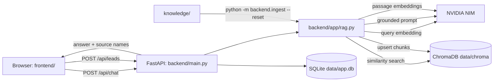

# Architecture

## Purpose

This project is intentionally narrow: a visitor asks a company FAQ question, the backend retrieves relevant text from ChromaDB, NVIDIA NIM writes a grounded answer, and an optional consultation form stores a lead in SQLite. NVIDIA NIM is the only AI provider; there is no Ollama or local-model path.

## Request flows

### FAQ answer

1. `frontend/js/app.js` validates that a browser question is non-empty and sends it to `POST /api/chat`.
2. `backend/main.py` validates the JSON with `ChatRequest` from `backend/app/models.py`.
3. `answer_question()` in `backend/app/rag.py` asks NIM for a **query** embedding and uses it to retrieve the top Chroma chunks.
4. It builds a short prompt containing only those chunks and asks NIM's chat-completions endpoint for the answer.
5. The API returns the answer and the source file/page names. Browser output is rendered with `textContent`, so model text cannot become executable HTML.

### Portfolio answer

Portfolio requests are intentionally different from ordinary questions. During indexing, chunks inside `SECTION: PORTFOLIO` / `COMPANY PORTFOLIO` are tagged with `is_portfolio=true`. A question containing terms such as “portfolio”, “projects”, or “our work” asks ChromaDB for **every** tagged chunk, instead of the usual top-four semantic matches. The NIM prompt requires all projects in a four-column Markdown table; the frontend safely converts that table to a responsive HTML table.

### Knowledge indexing

1. An operator adds supported `.pdf`, `.txt`, or `.md` files under `knowledge/`.
2. `python -m backend.ingest --reset` calls `index_knowledge()`.
3. The loader reads PDFs page-by-page, normalizes and splits text in overlapping, bounded windows, then hashes each chunk into a stable ID.
4. NIM embeds batches in **passage** mode; Chroma upserts the vectors. `--reset` removes obsolete chunks first.

### Lead capture

1. The “Talk to us” form sends validated fields to `POST /api/leads`.
2. `create_lead()` uses parameterized SQL to insert the record in `data/app.db`.
3. Lead data never enters the RAG prompt, ChromaDB, or NVIDIA API.

## Project structure

| Path | Responsibility | Connected to |
| --- | --- | --- |
| `backend/main.py` | FastAPI application, routes, security/CORS middleware, static frontend delivery, health check. | Imports schemas, lead repository, and RAG workflow. |
| `backend/ingest.py` | Safe manual command for indexing/re-indexing knowledge. | Calls `index_knowledge()`. |
| `backend/app/config.py` | The only environment-variable reader; defines paths, NIM settings, and RAG limits. | Imported by every backend component needing settings. |
| `backend/app/models.py` | Pydantic contracts for requests and API responses. | Used by API routes and lead repository. |
| `backend/app/database.py` | SQLite schema and parameterized lead insertion. | Used only by the lead route. |
| `backend/app/nvidia.py` | Minimal authenticated HTTP calls to NIM `/embeddings` and `/chat/completions`. | Used only by `rag.py`. |
| `backend/app/rag.py` | File loading, O(n) chunking, portfolio metadata tagging, Chroma persistence/search, and grounded-prompt construction. | Used by chat route and ingestion command. |
| `frontend/index.html` | Accessible chat UI and `<dialog>` lead form. | Loads CSS and `app.js`. |
| `frontend/js/app.js` | Browser fetch calls, DOM rendering, client state, and form feedback. | Talks only to `/api/*`. |
| `frontend/css/style.css` | Responsive visual styling. | Used by `index.html`. |
| `knowledge/` | Source files that define what the assistant can answer. | Input to the ingestion command. |
| `data/` | Runtime-only Chroma vectors and SQLite leads; Git ignored and mounted by Docker. | Created automatically at runtime. |
| `Dockerfile`, `docker-compose.yml` | Repeatable single-container deployment with persistent storage. | Reads deployment settings from `.env`. |
| `.env.example` | Complete non-secret configuration template. | Copy to `.env` locally or map to deployment secrets. |
| `backend/tests/` | Fast offline tests for the HTTP surface, deterministic database behavior, and chunking. | Run with `pytest`. |

## Performance and scaling notes

- Indexing is linear in the total source text and embeds batches of 32 chunks. Querying uses Chroma's approximate nearest-neighbor index rather than scanning each document in application code.
- Retrieval is capped by `RETRIEVAL_LIMIT`, and the prompt is capped by `MAX_CONTEXT_CHARACTERS`; both control latency and NIM spend.
- The browser has no client framework or build process, which keeps its initial download and operational surface small.
- One FastAPI container with SQLite is the supported default. For horizontal scaling, place a rate limit at the edge, migrate leads to PostgreSQL, and move vectors to shared persistent storage.

## Operational checklist

1. Set a real `NVIDIA_API_KEY` and HTTPS `ALLOWED_ORIGINS`/`ALLOWED_HOSTS`.
2. Index production knowledge before starting traffic.
3. Persist and back up `data/`, especially `data/app.db`.
4. Re-index with `--reset` after every knowledge change or embedding-model change.
5. Run `pytest` and check `/health` in CI/deployment health checks.
6. Use a TLS reverse proxy and an edge rate limiter for public traffic.
